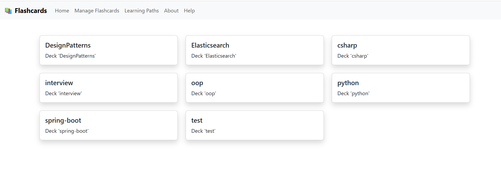
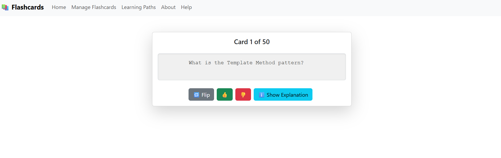
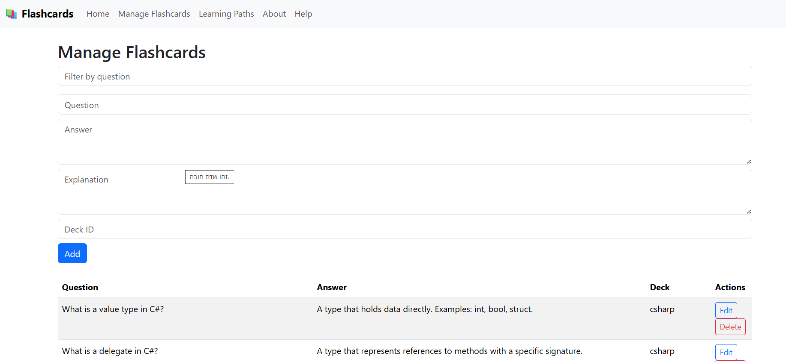
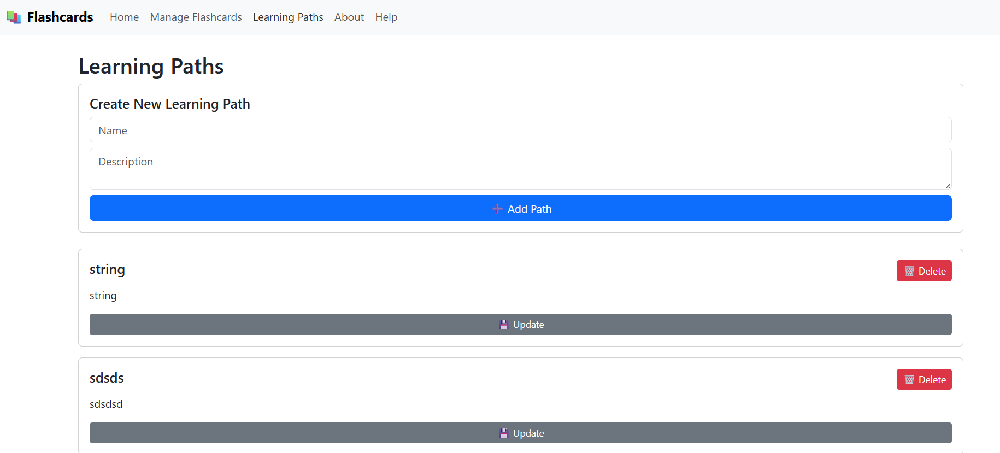

# 📚 Flashcards AI Learning App

An interactive flashcard-based learning platform that allows users to study, create, manage, and generate flashcards using AI. Built with Angular (frontend), FastAPI (Python backend), Qdrant (vector storage), and OpenAI GPT-4 (AI generation).

---

## ✨ Features

- ✅ Study random or deck-specific flashcards
- ✏️ Add / Edit / Delete flashcards via admin UI
- 📦 Deck management (auto-detected from flashcards)
- 🤖 Generate 50 high-quality flashcards with AI (OpenAI GPT-4)
- 🔍 Filter flashcards by question text
- 🌐 Fully functional REST API
- 💾 Vector storage powered by Qdrant
- 📱 Installable PWA with offline support (caches decks and flashcards)

---

## 📸 Screenshots

### 🧠 Home – Deck Selection


### 🎓 Study Flashcards


### 🛠️ Manage Flashcards


### 🧭 Learning Paths


---

## 🛠️ Tech Stack

| Layer         | Tech                                  |
|---------------|----------------------------------------|
| Frontend      | Angular + Bootstrap                    |
| Backend       | FastAPI (Python)                       |
| Storage       | Qdrant                                 |
| AI Generator  | Sentence Transformers embeddings       |
| Format        | JSON-based flashcard structure         |

---

## 📂 Project Structure

```
├── backend (FastAPI API)
│   ├── app
│   ├── tests
├── frontend
│   └── flashcards-ui (Angular 17+ standalone)
│       ├── components: home, flashcard, admin
│       ├── services: FlashcardService, DeckService
│       ├── assets, styles, routing
├── docs
│   └── images (used in README)
```

---

## 🚀 Getting Started

### Prerequisites
- Node.js + Angular CLI
- Python 3.11 with [Pipenv](https://pipenv.pypa.io/)
- Qdrant running locally
- OpenAI API Key (for GPT-4 generation)

### Run Frontend

```bash
cd frontend/flashcards-ui
npm install
ng serve
```

# Build mobile apps with Ionic

To generate native Android and iOS projects using Capacitor run:

```bash
npm run build:mobile
npx cap add android
npx cap add ios
```

Launch the native IDEs with:

```bash
npm run android
# or
npm run ios
```


When accessing the app from another device, use HTTPS so the service worker can
register and display the install icon:

```bash
ng serve --ssl --host 0.0.0.0
```

### Run Backend

```bash
cd backend
pipenv install --dev
pipenv run uvicorn app.main:app --reload --port 5000
```

### Build & Test

```bash
cd backend
pipenv install --dev
pipenv run pytest
```

### Docker Compose

Spin up the entire stack (backend, frontend and Qdrant database) using Docker Compose:

```bash
docker-compose up
```

### API Docs (Swagger)
Visit [http://localhost:5000/swagger](http://localhost:5000/swagger)

### 🔐 Authentication
The backend secures admin routes using JWT tokens. Log in with the seeded
`admin` user to obtain a token. Include an `Authorization: Bearer <token>`
header when calling protected endpoints. See
[docs/api-authentication.md](docs/api-authentication.md) for detailed steps,
including how to create additional users.

---

## ⚙️ Environment Setup

Create a `.env.dev` file inside `backend` with your local configuration.
`QDRANT_HOST` should point to your running Qdrant instance (for example `10.0.0.9`):

```bash
QDRANT_HOST=10.0.0.9
QDRANT_PORT=6334
JWT_KEY=CHANGE_ME
LLM_PROVIDER=openai
LLM_SYSTEM_PROMPT="You are a helpful assistant that answers questions for a flashcard. Respond in JSON with 'answer' and 'explanation' fields."
```

---

## 📤 API Highlights

| Method | Endpoint                      | Description                        |
|--------|-------------------------------|------------------------------------|
| GET    | `/flashcards`                 | Get all flashcards                 |
| GET    | `/flashcards/{deckId}/random`| Get random cards by deck           |
| POST   | `/flashcards`                 | Add a new flashcard                |
| PUT    | `/flashcards/{id}`            | Update flashcard                   |
| DELETE | `/flashcards/{id}`            | Delete flashcard                   |
| POST   | `/api/generate/flashcards`   | Generate flashcards with GPT-4     |

---

## 🧠 Flashcard Model

```json
{
  "id": "string",
  "question": "string",
  "answer": "string",
  "explanation": "string",
  "score": 0,
  "deckId": "string"
}
```

---

## 🙌 Contributing

Pull requests welcome! If you'd like to extend the platform (e.g., export to PDF, spaced repetition engine, or analytics), feel free to fork and contribute.

---

## 📃 License

MIT © 2024 FlashcardsAI Team